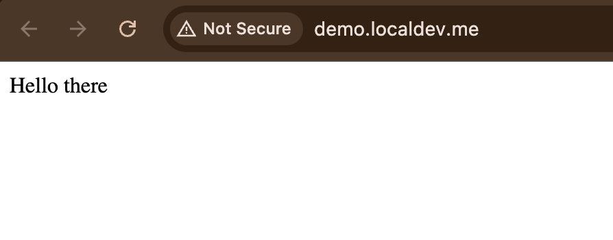

# Instrumenting Spring applications with OpenTelemetry and Cloud-native Buildpacks

In this tutorial, we are building a container image for a simple Spring Boot application using the support for [Cloud Native Buildpacks](https://buildpacks.io/) built into the Spring Boot tooling, and using Paketo's [OpenTelemetry buildpack](https://github.com/paketo-buildpacks/opentelemetry) to ensure that the OpenTelemetry Java agent is part of the container image, and that it can monitor our Spring Boot application with just a few configurations. 

## What is this all about?

Alright, the previous paragraph was a mouthful, let's break it down a little.

### About Spring Boot

Spring Boot is probably the best way to:

> create stand-alone, production-grade Spring based Applications that you can 'just run'.

_From [Spring Boot](https://spring.io/projects/spring-boot)_

In a nutshell, it is a framework with comprehensive facilities for configuring and building Spring-based applications written in Java or Kotlin (or both!) so that all you need to do to make them run, is execute a `java -jar`.

If you are not familiar with Spring or Spring Boot, then go check out the breathtaking dev-rel work of [Josh Long a.k.a. @Starbuxman](https://github.com/joshlong).
We'll wait.

### About Cloud-native buildpacks

Everybody has written a Dockerfile or ten.
But are your (or my) Dockerfiles amazing, configurable, maintainable and compliant?
Let's face it, probably not.

And this is where Cloud Native Buildpacks come into play: they provide a comprehensive set of building blocks to create professional-grade container images to run your applications.
For example, consider something as apparently simple as running a Java application in a container.
It's not much, right?
You make sure there is a JRE or a JDK in the container image, slap your executable Jar file (maybe built with [Spring Boot](#about-spring-boot)) in it, set the entrypoint, and you are done, right?

Well, it depends.
A simple Java application, that does not need to serve much load, will be fine with that.
But then, you might have not had to fine-tune the memory settings of the Java Virtual Machine that much.
(In which case: count yourself lucky, although it's a _lot of fun (TM)_ you are missing out on.)
The [Java cloud native buildpack](https://github.com/paketo-buildpacks/java) can do that for you using the [Java memory calculator](https://paketo.io/docs/reference/java-reference/#memory-calculator), and then you just need to tweak a couple of relatable settings like thread count, as opposed to cracking out the calculator, a reference guide of the memory layout of Java virtual machines, and going to town on it. 
The Java cloud native buildpack also makes it very easy to set up [SSL CA certificates](https://github.com/paketo-buildpacks/java?tab=readme-ov-file#:~:text=paketo%2Dbuildpacks/ca%2Dcertificates), the necessary tooling to be able to remotely attach to your JVM for debug purposes with [`jattach`](https://github.com/paketo-buildpacks/jattach), and a bajilion other things.

Oh, yes, and there is the [OpenTelemetry buildpack](https://github.com/paketo-buildpacks/opentelemetry) to ensure that the [OpenTelemetry Java agent](https://github.com/open-telemetry/opentelemetry-java-instrumentation) is in the container image, ready to rock.
And if you are now wondering "OK, what's OpenTelemetry", read on ;-)

### About OpenTelemetry

What's [OpenTelemetry](https://opentelemetry.io/)?
In short, OpenTelemetry is the best thing to happen in observability in a while:

> OpenTelemetry (OTel) is an open-source observability framework.
> It solves the telemetry collection and transmission aspects of observability, but it is not a backend, analytics or visualization tool.
> OpenTelemetry is part of the Cloud Native Computing Foundation (CNCF), which also hosts projects like Kubernetes or Prometheus, and it is the second most active CNCF project just behind Kubernetes.

_From [What is OpenTelemetry?](https://www.dash0.com/faq/what-is-opentelemetry)_

OpenTelemetry provides specifications and high-quality implementations of ways to collect logs, metrics and distributeds tracing data (a.k.a. spans) from your applications.
The OpenTelemetry Java agent, specifically, is a one-stop shop to monitor your Java applications.
And we are going to use it in this demo to monitor a simple Spring Boot application with barely a few configurations.

## Setup

## Local Kubernetes cluster with Minikube

### Setting up an ingress controller

This step is optional, if you want to be able to send requests to the demo application from outside your Kubernetes cluster (which you probably should).
With `minikube`, it is as easy as executing:

```shell
minikube addons enable ingress
```

**Note:** Before being able to use the ingress you just installed, you will likely need to set up a tunnel, see the [Trying it out](#trying-it-out) section.
We are postponing this step until later, because it will require you to keep the shell busy running the tunnel, and that can trip people up.

### Create the application container image

If you are running this demo from `minikube`, chances are you need to ensure that the container image we are going to build will be available from within `minikube` itself.
The easiest way to do this is to use `minikube`'s own Docker daemon to build the container image, which is as simple as exporting some settings in your shell environment.

```shell
eval $(minikube docker-env)
```

Create the docker image using the [`spring-boot` Maven plugin](https://docs.spring.io/spring-boot/maven-plugin/index.html) configured in the [`pom.xml`](./pom.xml) file:

```shell
./mvnw package spring-boot:build-image
```

### Deploy the demo application

Edit the [deployment manifest](./src/main/kubernetes/deployment.yaml) to specify the OTLP endpoint, i.e., the URL to which the OpenTelemetry Java agent will send spans, metrics and logs:

```yaml
# This snippet is from the src/main/kubernetes/deployment.yaml file
- name: OTEL_EXPORTER_OTLP_ENDPOINT
  # Replace this with the actual OTLP endpoint you want to use
  value: *otlp-endpoint
```

It might be you actually want to send logs, spans and metrics to different tools.
If so, set instead the `OTEL_EXPORTER_OTLP_TRACES_ENDPOINT`, `OTEL_EXPORTER_OTLP_METRICS_ENDPOINT` and `OTEL_EXPORTER_OTLP_LOGS_ENDPOINT` environment variables.
More information on how to configure where your telemetry will be sent via OTLP is available on the [OpenTelemetry Protocol Exporter page](https://opentelemetry.io/docs/specs/otel/protocol/exporter/) of the OpenTelemetry website.

If your observability tool requires authentication, it usually will accept some form of token-based authentication via the `Authorization` header, which you can specify via the `OTEL_EXPORTER_OTLP_HEADERS` environment variable:

```yaml
# This snippet is from the src/main/kubernetes/deployment.yaml file
- name: OTEL_EXPORTER_OTLP_HEADERS
  # Replace this with the HTTP headers your OTLP endpoint requires for authorization
  value: *otlp-auth-headers
```

Install manifests in your Kubernetes cluster:

```shell
kubectl apply -f src/main/kubernetes
```

### Trying it out

Now all that is missing is to make `minikube`'s ingress network-reachable to the rest of your machine with:

```shell
minikube tunnel
```

On Mac OS X, this command might ask your password to be able to bind to the system ports `80` and `443`.

And there you go!
Your application should be available at http://demo.localdev.me



_A thing of beauty, is it not?_

## And now, try it with Dash0

Since you have gotten it this far, how about trying this demo with [Dash0](https://www.dash0.com/), the OpenTelemetry-native tool that makes observability simple and enjoyable?
There's a free trial waiting for you, 14 days, no questions asked: https://www.dash0.com/sign-up

You will find the values for to set for the `OTEL_EXPORTER_OTLP_ENDPOINT` and `OTEL_EXPORTER_OTLP_HEADERS` in the [OpenTelemetry Java onboarding instructions](https://app.dash0.com/onboarding/instructions/programming-languages/java).
Enjoy!
